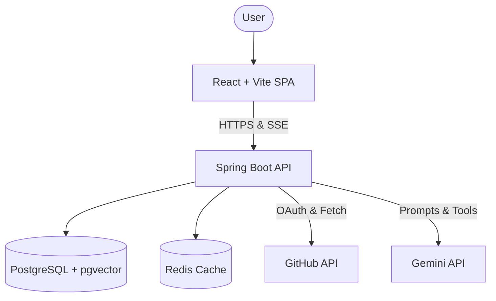

# DevPilot

## Live Demo
https://<actual-vercel-url> (To be updated after deployment)

DevPilot is an advanced AI Engineering Agent and Repository Intelligence platform. It combines deterministic AST (Abstract Syntax Tree) parsing with an autonomous AI agent to help you understand, debug, and refactor codebases safely and efficiently.

## Features
- **Repository-Aware AI Agent**: Ask complex architectural or debugging questions. The agent uses autonomous tool-calling to fetch exactly what it needs.
- **RAG (Retrieval-Augmented Generation)**: Semantic codebase search powered by vector embeddings and `pgvector`, eliminating the "lost in the middle" LLM context problem.
- **AST Architecture Graphs**: Deterministic dependency extraction generating 100% accurate visual graphs of your Java codebase.
- **Static Security Analysis**: Automated scanning for hardcoded secrets, empty catch blocks, and weak cryptography using AST patterns.
- **GitHub Integration**: Seamless OAuth login and single-click repository ingestion.
- **Real-Time Processing**: Asynchronous background workers process repositories while streaming live progress to the UI via Server-Sent Events (SSE).

## Architecture



## Tech Stack
- **Frontend**: React 19, Vite, TypeScript, TailwindCSS, ReactFlow (Deployed on **Vercel**).
- **Backend**: Java 17, Spring Boot 3, Spring Security, JavaParser (Deployed on **Render**).
- **Database**: PostgreSQL 16 with `pgvector` extension (Hosted on **Neon**).
- **AI**: Gemini Pro API (via LLM function calling).
- **Infrastructure**: Docker, Docker Compose, GitHub Actions.

## Installation & Running Locally

### Prerequisites
- Docker & Docker Compose installed.
- API Keys for Gemini and GitHub OAuth.

### 1. Environment Setup
Copy the example environment file:
```bash
cp .env.example .env
```
Fill in your `AI_API_KEY`, `GITHUB_CLIENT_ID`, and `GITHUB_CLIENT_SECRET`.

### 2. Run with Docker Compose
The easiest way to run the entire stack (Frontend, Backend, DB, Redis) locally is using Docker Compose:
```bash
docker-compose up --build
```
- Frontend will be available at: http://localhost:5173
- Backend API will be available at: http://localhost:8080

*(For manual setup without Docker, refer to [docs/development.md](docs/development.md))*

## Documentation Overview
Deep-dive into the engineering and architecture of DevPilot:
- [System Architecture](docs/architecture.md)
- [AI & RAG Architecture](docs/ai-architecture.md)
- [Repository & AST Analysis](docs/repository-analysis.md)
- [Security & Authentication](docs/security.md)
- [REST API](docs/api.md)
- [Limitations](docs/limitations.md)

## Testing
We maintain unit and integration tests across both the frontend and backend.
- Backend: `cd backend && mvn test`
- Frontend: `npm run test`

## Limitations
- **Languages**: Currently, deep AST parsing and architecture generation is limited to **Java** repositories. Other languages fallback to basic chunking.
- **LLM Dependency**: Advanced agent features require an active internet connection to the Gemini API.

## Future Improvements
- **Message Broker**: Introduce RabbitMQ or Kafka for more robust, scalable ingestion queueing.
- **Multi-Language AST**: Integrate Tree-sitter for native AST parsing of TypeScript, Python, and Go.
- **HNSW Indexing**: Implement advanced indexing in `pgvector` for massive codebases.

---
*DevPilot was built as a portfolio project showcasing modern Software Engineering, AI orchestration, and lightweight infrastructure.*
