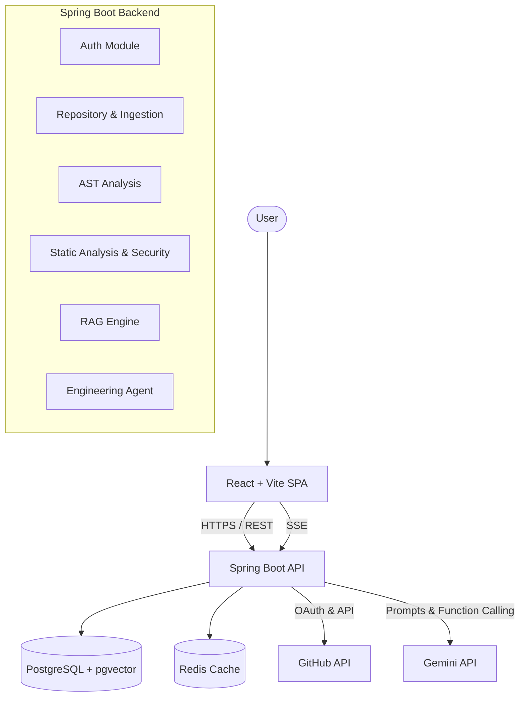

# Architecture

DevPilot is engineered as a **Modular Monolith** using Spring Boot for the backend and a Vite + React SPA for the frontend.

## High-Level Architecture

## Component Breakdown

### 1. Frontend (React + Vite)
The frontend serves as the control panel for the user to import repositories, view architectural graphs, and interact with the AI Engineering Agent.
- **Why React + Vite?** React provides a robust ecosystem for complex state (like interactive chat and graph visualizations), and Vite ensures blazing-fast HMR and optimized builds.

### 2. Backend (Spring Boot)
The core logic resides in a single, well-structured Java application.
- **Why Spring Boot?** It provides enterprise-grade structure, powerful dependency injection, built-in security, and excellent background job capabilities (via `@Async` and executors).
- **Why Modular Monolith?** Early-stage projects suffer heavily from microservice overhead. A modular monolith provides the internal boundaries of microservices (easy to split later) without the network complexity, distributed tracing needs, or deployment headaches.

### 3. Database (PostgreSQL + pgvector)
PostgreSQL handles all relational data (users, repositories, analyses) AND vector embeddings.
- **Why PostgreSQL?** It is the most robust, ACID-compliant open-source relational database.
- **Why pgvector?** Instead of maintaining a separate vector database (like Pinecone or Milvus), `pgvector` allows us to store code chunk embeddings right alongside the relational data. This vastly simplifies the architecture, backup strategies, and cross-joining metadata with vectors.

### 4. External Integrations
- **GitHub**: Handles authentication (OAuth) and provides the raw repository data (cloning/fetching).
- **LLM Provider (Gemini)**: We use an API-based LLM.
- **Why API-based LLM?** Running a local LLM capable of advanced reasoning (like Llama 3 70B) requires significant hardware (multiple GPUs) which is cost-prohibitive for lightweight deployment. Using an API offloads the heavy lifting while allowing the agent to function intelligently.

### 5. Asynchronous Processing & SSE
When a repository is imported, it requires cloning, AST parsing, chunking, embedding generation, and static analysis.
- **Why Asynchronous?** These tasks can take minutes for large repositories. We cannot block HTTP threads.
- **Why SSE (Server-Sent Events) over WebSockets?** SSE is strictly unidirectional (Server -> Client). Since the client only needs to *listen* to progress updates during ingestion, SSE is far simpler to implement, requires less overhead, and handles disconnects natively better than WebSockets.

### 6. Redis (Optional)
Redis is configured to handle caching for external API calls (like GitHub tree fetching) to prevent rate limits. It is kept optional so the core application can run in highly constrained environments without it.
